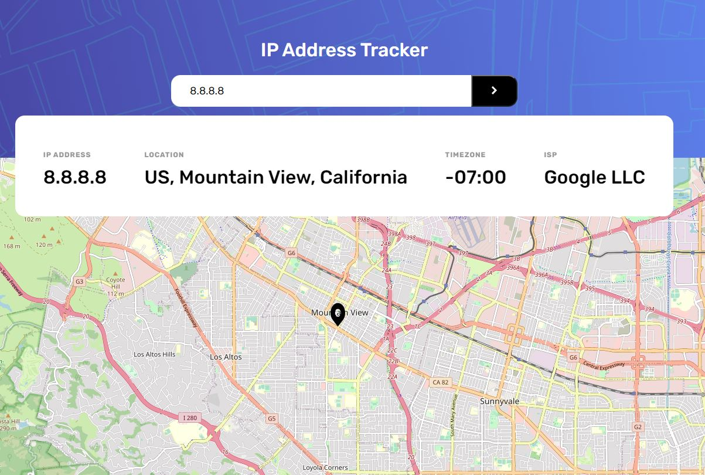

# ip-address-tracker

This is a solution to the [IP address tracker challenge on Frontend Mentor](https://www.frontendmentor.io/challenges/ip-address-tracker-I8-0yYAH0).

Setup:

```bash
# install dependencies
$ yarn install

# serve with hot reload at localhost:3000
$ yarn dev

# build for production and launch server
$ yarn build
$ yarn start

# generate static project
$ yarn generate
```

For detailed explanation on how things work, check out the [documentation](https://nuxtjs.org).

## Table of contents

- [Overview](#overview)
  - [The challenge](#the-challenge)
  - [Screenshot](#screenshot)
- [My process](#my-process)
  - [Built with](#built-with)
  - [What I learned](#what-i-learned)
  - [Continued development](#continued-development)
  - [Useful resources](#useful-resources)
- [Author](#author)

## Overview

### The challenge

Users should be able to:

- View the optimal layout for each page depending on their device's screen size
- See hover states for all interactive elements on the page
- See their own IP address on the map on the initial page load
- Search for any IP addresses or domains and see the key information and location

### Screenshot



## My process

### Built with

- Nuxt 2
- Express
- Axios
- Scss
- Vue Leaflet
- Eslint + Prettier

### What I learned

I learned how to use Express + Nuxt.js.

### Continued development

It would be interesting to improve the empty states and error handling.

### Useful resources

- [Vue Leaflet documentation](https://vue2-leaflet.netlify.app/) - This helped me to setup the plugin.

## Author

- Linkedin - [Lana Schuster](https://www.linkedin.com/in/lana-schuster-48b896195/)
- Frontend Mentor - [@lanaschuster](https://www.frontendmentor.io/profile/lanaschuster)
